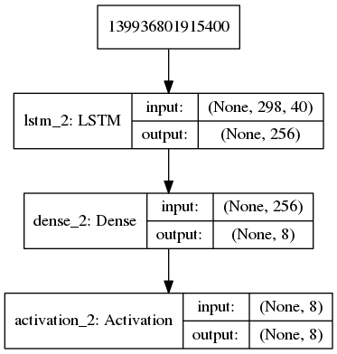
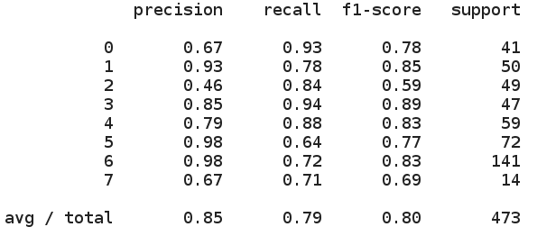

# Классификатор звуковых событий

## Основная задача

### Архитектура

Для построения классификатора была использована рекуррентная нейронная сеть LSTM. 

 
 
### Извлечение признаков

Так как представленные аудиофайлы разной длины, то было решено в качестве тренировочного семпла использовать отрывок длиной 3 секунды.В случае если аудиофайл короче 3 секунд, он в случайном порядке обрезался. Если он длиннее, то он удлинялся с помощью метода np.pad(sample, 'reflect').
В качестве признаков были использованы log mel filterbank energies со стандартными параметрами. Признаки извлекались с помощью библиотеки PySpeech.

### Результаты 
Для оценки точности модели были использованы precision, recall и f1-score.

## Детектор
Детектор определяет, наличие факта события в аудиофайле. Для этого был обучение классификатор для бинарной классификации классов: event и background. В качестве признаков также использовались log mel filterbank energies со стандартными параметрами. Признаки извлекались с помощью библиотеки PySpeech. 

## Открытая задача
Результаты работы модели на неизвестных аудиофайлах представлена в файле result-unknown.txt
